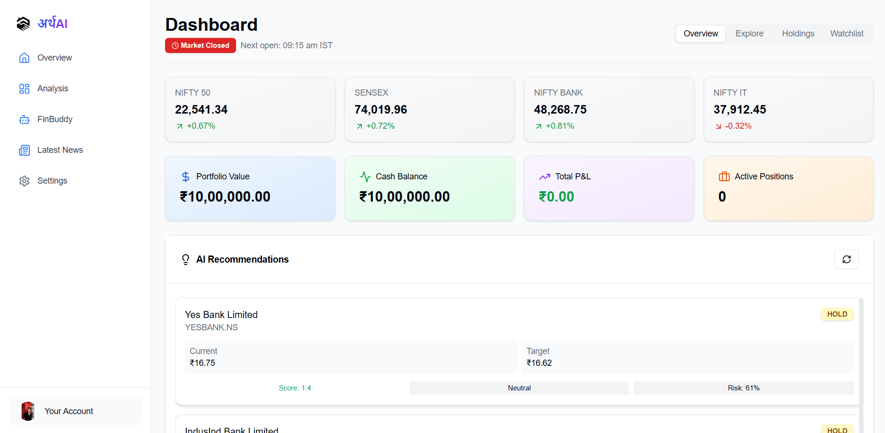
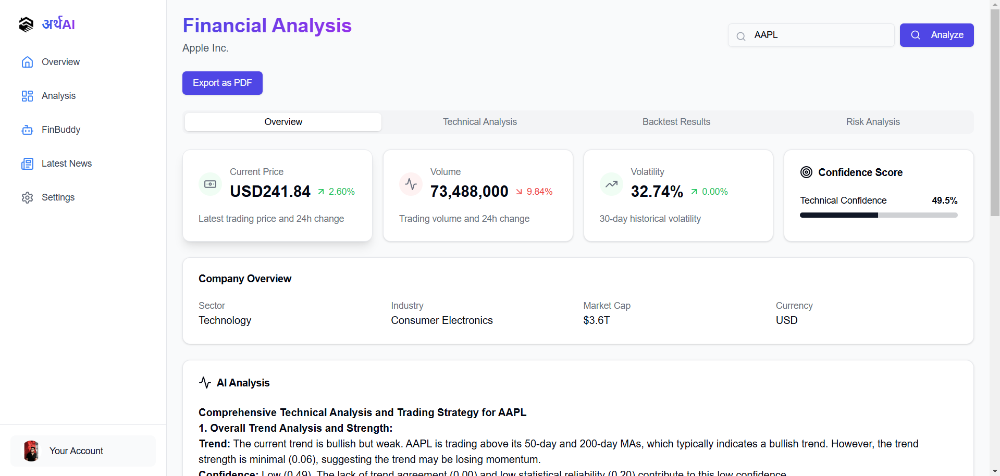

## AI-Driven Equity Market Analysis & Stock Prediction
One-stop solution for stock analysis, real-time trading simulation, live updates, financial document processing, and AI-powered stock recommendations.

## Project Overview
This project aims to create an AI-powered financial tool that helps users:
Analyze stocks using market trends and technical indicators
Simulate real-time trading and backtest strategies
Process financial documents using Agentic Document Extraction API
Get real-time updates on stocks via WhatsApp (Twilio API)
Chat with AI to clarify financial jargon and analyze documents

## Features
Financial Document Processing – Extracts insights using OCR + RAG
Live Market Data – Aggregates stock prices, news, and economic trends
AI Stock Recommendations – Uses ML models for stock analysis
Trading Simulation – Real-time trade testing & strategy analysis
AI Chatbot – Explains financial jargon and document insights
WhatsApp Alerts – Sends stock updates & reports via Twilio API

## Tech Stack
Frontend:	React.js, Next.js, Tailwind CSS
Backend:	Node.js, Flask ,Monte Garlo simulation , Twilio APi , Yahoo Finance
AI/NLP:	deepseek-r1-distill-llama-70b , llama 3.2- 90b
Document Processing:	Agentic Document Extraction ,RAG

# Installation Guide

## Prerequisites
Ensure you have the following installed:
- Node.js (v16+)
- Python (v3.8+)
- npm / yarn
- pip / pipenv
- Git

---

## Backend Setup (FastAPI & Flask)

### Clone the Repository
bash
git clone https://github.com/your-username/your-repo.git
cd your-repo/backend

### Create and Activate a Virtual Environment
bash
python -m venv venv
source venv/bin/activate  # For Mac/Linux
venv\Scripts\activate    # For Windows

### Install Dependencies
bash
pip install -r requirements.txt

### Set Up Environment Variables
Create a .env file in the backend directory:
ini

TWILIO_SID="your_twilio_sid"
TWILIO_AUTH_TOKEN="your_twilio_auth_token"

### Run the Backend Server
bash
uvicorn main:app --reload

Backend will run at http://127.0.0.1:8000/.

---

## Frontend Setup (React.js & Next.js)

### Navigate to the Frontend Directory
bash
cd ../frontend

### Install Dependencies
bash
npm install  # or yarn install

### Set Up Environment Variables
Create a .env.local file in the frontend directory:
ini
NEXT_PUBLIC_BACKEND_URL="http://127.0.0.1:8000/"

### Run the Frontend Server
bash
npm run dev  # or yarn dev

Frontend will run at http://localhost:3000/.

---
npm run dev  # or yarn dev

Frontend will run at http://localhost:3000/.

---
